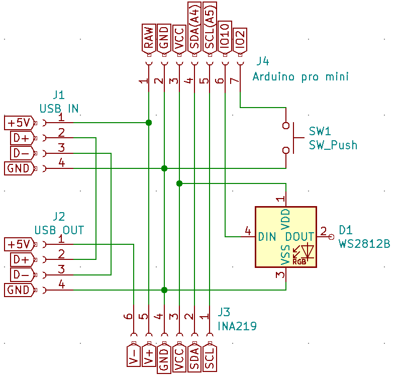

Arduino firmware for my [GEODESIC NIGHT LAMP](https://www.thingiverse.com/thing:4718640). The Lamp was designed by [JKustom](https://www.thingiverse.com/Jkustom). The only Thing I modified is the the switch - I replaced it with a push button. Ofcourse the schematic/firmware can be used for any other Lamp.

I used an Arduino pro mini with a INA219 current sensor. The LEDs used are WS2812b LEDs.

